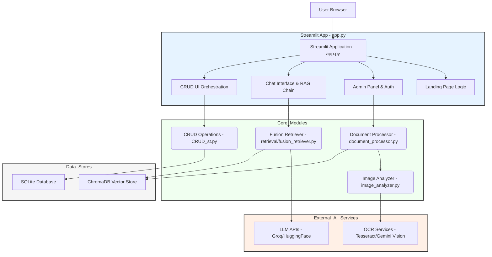
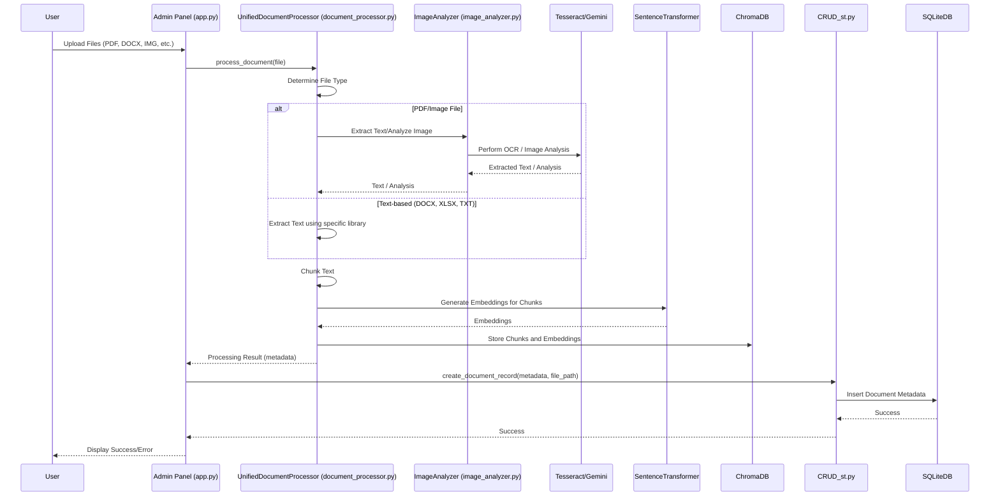
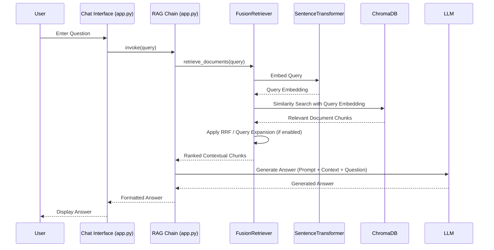
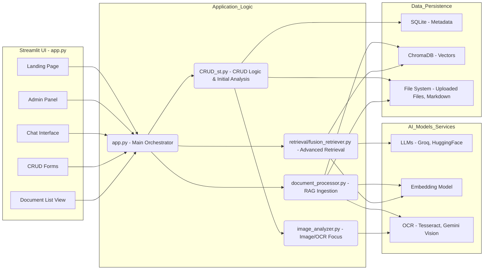

# HKI Records Management System: Comprehensive Analysis

**Date:** October 26, 2023
**Version:** 1.0

## Table of Contents

1.  [Introduction](#introduction)
2.  [Product Manager Perspective](#product-manager-perspective)
    *   [Purpose and Value Proposition](#purpose-and-value-proposition)
    *   [Key Features](#key-features)
    *   [Target Users](#target-users)
    *   [User Stories (Examples)](#user-stories-examples)
    *   [Potential Future Enhancements](#potential-future-enhancements)
3.  [Software Architect Perspective](#software-architect-perspective)
    *   [System Architecture Overview](#system-architecture-overview)
    *   [Key Technologies and Frameworks](#key-technologies-and-frameworks)
    *   [Data Flow Diagrams](#data-flow-diagrams)
        *   [Document Ingestion and Processing Flow](#document-ingestion-and-processing-flow)
        *   [RAG Chatbot Query Flow](#rag-chatbot-query-flow)
    *   [Component Breakdown and Interactions](#component-breakdown-and-interactions)
    *   [Data Storage Strategy](#data-storage-strategy)
    *   [AI/ML Integration Strategy](#aiml-integration-strategy)
    *   [Security Considerations](#security-considerations)
    *   [Scalability and Performance](#scalability-and-performance)
    *   [Deployment Model](#deployment-model)
4.  [Software Developer Perspective](#software-developer-perspective)
    *   [Codebase Structure and Key Modules](#codebase-structure-and-key-modules)
    *   [Core Logic Walkthroughs](#core-logic-walkthroughs)
        *   [Admin Authentication (`app.py`)](#admin-authentication-apppy)
        *   Document Upload and Initial Analysis (`CRUD_st.py`)
        *   Document Processing for RAG (`app.py`, `document_processor.py`)
        *   CRUD Operations Implementation (`CRUD_st.py`)
        *   RAG Chain Setup and Execution (`app.py`)
    *   Database Schema (SQLite)
    *   Key Classes and Functions Deep Dive
        *   `UnifiedDocumentProcessor` (`d:\p3ri\arsipy-hki\document_processor.py`)
        *   `EnhancedModelManager` & `DocumentMetadataExtractor` (`d:\p3ri\arsipy-hki\image_analyzer.py`)
        *   `FusionRetriever` (`d:\p3ri\arsipy-hki\retrieval\fusion_retriever.py`)
        *   LLM Integration (`app.py`)
    *   Environment and Dependencies
    *   Code Quality and Maintainability Observations
    *   Potential Areas for Refactoring or Improvement
5.  Conclusion

## Introduction

The HKI Records Management System (RMS) is a sophisticated web application designed to streamline the management, retrieval, and analysis of construction project records for HKI (Hutama Karya Infrastruktur, inferred). It leverages modern AI and machine learning technologies, including Large Language Models (LLMs) and Optical Character Recognition (OCR), to provide an intelligent, efficient, and user-friendly platform. The system features a RAG (Retrieval Augmented Generation) based chatbot for querying document contents, comprehensive CRUD (Create, Read, Update, Delete) functionalities for record metadata management, and an admin panel for system control and document ingestion.

This document provides an extensive analysis of the HKI RMS from three key perspectives: Product Manager, Software Architect, and Software Developer, aiming to offer a holistic understanding of its design, functionality, and technical implementation.

---

## Product Manager Perspective

### Purpose and Value Proposition

**Purpose:** To modernize and enhance HKI's records management processes for construction projects by providing a centralized, AI-powered digital platform. This system aims to improve information accessibility, ensure data integrity, support compliance, and boost operational efficiency.

**Value Proposition:**
*   **Enhanced Efficiency:** Drastically reduces time spent searching for and extracting information from project documents through AI-powered search and analysis.
*   **Improved Accessibility:** Centralized digital repository makes records easily accessible to authorized personnel, anytime, anywhere.
*   **Intelligent Insights:** The RAG chatbot allows users to ask complex questions about document contents and receive summarized, context-aware answers with source references.
*   **Data-Driven Decision Making:** Quick access to accurate information supports better and faster decision-making.
*   **Streamlined Compliance:** Facilitates adherence to record-keeping standards and regulations (e.g., ISO 15489, national archival rules mentioned in `d:\p3ri\arsipy-hki\landing_page.py`).
*   **Automated Metadata Extraction:** AI assists in automatically populating metadata fields during document upload, reducing manual effort and improving consistency.

### Key Features

1.  **Landing Page (`d:\p3ri\arsipy-hki\landing_page.py`):**
    *   Professionally designed entry point introducing the system's purpose and benefits.
    *   Secure transition to the main application.

2.  **Admin Panel (`d:\p3ri\arsipy-hki\app.py`):**
    *   Password-protected access for administrators.
    *   **Document Upload:** Supports various file types (PDF, TXT, PNG, JPG, JPEG, XLSX, DOCX).
    *   **Document Processing:** Initiates AI-driven text extraction, OCR, chunking, and indexing into a vector store (ChromaDB) for RAG.
    *   **System Reset:** Functionality to clear the vector database and processed file logs.

3.  **Records Management (CRUD) (`d:\p3ri\arsipy-hki\CRUD_st.py`, `d:\p3ri\arsipy-hki\app.py`):**
    *   **Create Document Record:**
        *   Form for manual input of document metadata.
        *   AI-powered analysis of uploaded files (`analyze_uploaded_document` in `CRUD_st.py`) to pre-fill form fields (title, description, doc number, archive code, department).
        *   Support for multiple file uploads per record.
    *   **Read Document Records:**
        *   Tabular display of all document records with comprehensive details.
        *   Filtering capabilities (by department, project, archive code, status).
        *   Export to CSV.
    *   **Update Document Record:**
        *   Form to modify existing document metadata.
    *   **Delete Document Record:**
        *   Secure deletion of document records and associated files (admin-only).
        *   Bulk delete option with confirmation.

4.  **AI-Powered Chatbot (`d:\p3ri\arsipy-hki\app.py`):**
    *   RAG-based question answering using ingested documents.
    *   Utilizes `FusionRetriever` for enhanced retrieval accuracy.
    *   Supports multiple LLMs (Llama 4 Maverick via Groq, DeepSeek via HuggingFace).
    *   Formatted responses including summary, details, technical specifications, and document references.
    *   Chat history display and clearing functionality.

5.  **Document Content Analysis (`d:\p3ri\arsipy-hki\document_processor.py`, `d:\p3ri\arsipy-hki\image_analyzer.py`):**
    *   **Text Extraction:** Handles PDF, DOCX, XLSX, images, and plain text.
    *   **Advanced OCR:**
        *   Cascading OCR (Tesseract first, then Gemini for images if Tesseract quality is low).
        *   Image enhancement pre-processing for better OCR accuracy.
    *   **Image Analysis:** Uses Gemini to describe image content, identify technical details, and explain context in construction documents.
    *   **Markdown Output:** Saves extracted text and image analyses as Markdown files.

6.  **User Interface (Streamlit):**
    *   Tabbed interface for Chatbot, Records Management, Document List, Guides, and About sections.
    *   Responsive design for usability.

### Target Users

*   **HKI Project Managers & Engineers:** For quick access to technical specifications, drawings, reports, and project documentation.
*   **HKI Archivists/Records Managers:** For managing the lifecycle of project records, ensuring compliance, and maintaining the integrity of the archive.
*   **HKI Department Staff (e.g., Teknik dan Desain, Sekretaris Perusahaan):** For accessing and managing documents relevant to their department.
*   **HKI Executives:** For high-level insights and status checks based on project documentation.

### User Stories (Examples)

*   **As a Project Engineer,** I want to upload a new design specification (PDF) so that its metadata is automatically extracted and it becomes searchable by the team.
*   **As a Project Manager,** I want to ask the chatbot "What are the concrete strength requirements for the Medan-Binjai project's bridge foundations?" so I can quickly find the relevant information without manually searching through multiple documents.
*   **As an Archivist,** I want to view a list of all documents related to the "TIP Pekanbaru - Dumai" project and filter them by "As Built" status so I can perform a compliance check.
*   **As an Administrator,** I want to upload a batch of historical project documents (various formats) so they are processed and added to the RAG system.
*   **As a Department Head,** I want to update the status of a document from "Diterbitkan untuk Konstruksi" to "As Built" once the work is completed.
*   **As a new HKI employee,** I want to use the chatbot to understand the standard procedure for document numbering as per the archival manual.

### Potential Future Enhancements

*   **Advanced Search:** Implement keyword search with faceting and sorting directly on the document list, beyond the current filters.
*   **Version Control for Documents:** Allow uploading new versions of existing documents and tracking version history.
*   **Workflow Automation:** Integrate simple approval workflows for document status changes.
*   **User Roles and Permissions:** More granular access control beyond the current admin/non-admin distinction.
*   **Reporting and Analytics:** Dashboards showing document statistics, processing times, popular queries, etc.
*   **Integration with other HKI Systems:** Connect with project management or ERP systems for seamless data flow.
*   **Automated Document Classification:** Use AI to automatically suggest department, project, or archive codes based on content.
*   **Enhanced Collaboration:** Features for commenting or annotating documents.
*   **Offline Access/Mobile App:** For field engineers or users with limited connectivity.
*   **Multilingual Support:** If HKI deals with international partners or documents in other languages.

---

## Software Architect Perspective

### System Architecture Overview

The HKI Records Management System is a monolithic application built with Streamlit, serving as both the frontend and backend orchestration layer. It integrates several specialized components for AI processing, data storage, and CRUD operations.



**Key Architectural Characteristics:**
*   **Streamlit-centric:** Streamlit manages the UI, application state, and acts as the primary request handler.
*   **Modular Python Backend:** Core functionalities like document processing, CRUD, and AI interactions are encapsulated in separate Python modules/classes.
*   **Dual Database System:**
    *   **SQLite:** Stores structured metadata about documents (title, dates, department, etc.). Managed by `d:\p3ri\arsipy-hki\CRUD_st.py`.
    *   **ChromaDB:** Serves as a vector store for document chunks and their embeddings, enabling semantic search for the RAG system.
*   **External AI Service Integration:** Relies on external APIs for LLM capabilities (Groq, HuggingFace) and advanced image analysis/OCR (Google Gemini). Tesseract is used locally for OCR.
*   **Admin-Gated Functionality:** Critical operations like document processing and deletion are protected by a simple password-based admin authentication.

### Key Technologies and Frameworks

*   **Frontend & Application Server:** Streamlit
*   **Backend Language:** Python
*   **AI/ML Orchestration:** LangChain
*   **LLMs:**
    *   `meta-llama/llama-4-maverick-17b-128e-instruct` (via Groq API)
    *   `deepseek-ai/DeepSeek-V3-0324` (via HuggingFace InferenceClient)
    *   Google Gemini (Pro for text, Flash for image analysis, via `google-generativeai` SDK)
*   **Embeddings:** `sentence-transformers/all-mpnet-base-v2` (via HuggingFaceEmbeddings in LangChain)
*   **Vector Store:** ChromaDB
*   **Relational Database:** SQLite3
*   **OCR:**
    *   Pytesseract (Tesseract OCR wrapper)
    *   Google Gemini Vision (for images, as part of `document_processor.py` and `image_analyzer.py`)
*   **Document Parsing:**
    *   PyMuPDF (Fitz) for PDFs
    *   `openpyxl` for XLSX
    *   `python-docx` for DOCX
    *   Pillow (PIL) for image manipulation
*   **Utility:** Werkzeug (for `secure_filename`), `python-dotenv`, `toml`.

### Data Flow Diagrams

#### Document Ingestion and Processing Flow



#### RAG Chatbot Query Flow



### Component Breakdown and Interactions



*   **`d:\p3ri\arsipy-hki\app.py` (Main Orchestrator):**
    *   Initializes Streamlit application, sets up UI tabs, and manages session state.
    *   Handles admin authentication and displays the admin panel.
    *   Orchestrates document upload and calls `UnifiedDocumentProcessor` for RAG ingestion.
    *   Manages the RAG chat interface, constructs the RAG chain using `FusionRetriever`, and interacts with LLMs.
    *   Integrates CRUD functionalities by calling functions from `CRUD_st.py`.
*   **`d:\p3ri\arsipy-hki\CRUD_st.py` (CRUD Logic & Initial Analysis):**
    *   Defines functions for Create, Read, Update, Delete operations on document metadata in SQLite.
    *   Initializes the SQLite database schema (`crud_init_db`).
    *   Includes `analyze_uploaded_document` to extract initial metadata from files to pre-fill creation forms (distinct from RAG ingestion).
    *   Handles file saving to the `uploads` folder.
*   **`d:\p3ri\arsipy-hki\document_processor.py` (RAG Ingestion Processor):**
    *   `UnifiedDocumentProcessor` class is responsible for processing various file types (PDF, DOCX, XLSX, images, text).
    *   Extracts text content, performs OCR (Tesseract, Gemini) with image enhancement and quality checks.
    *   Analyzes images using Gemini.
    *   Chunks text and prepares `Document` objects for LangChain.
    *   Adds processed documents to the ChromaDB vector store.
    *   Saves extracted content as Markdown files.
*   **`d:\p3ri\arsipy-hki\image_analyzer.py` (Image & OCR Specialist):**
    *   `EnhancedModelManager` and `DocumentMetadataExtractor` classes.
    *   Advanced image enhancement techniques for OCR.
    *   Multi-model analysis (Tesseract, Donut, Gemini) for robust metadata extraction from images.
    *   Focuses on extracting structured information like title, description, and dates from image-based documents.
*   **`d:\p3ri\arsipy-hki\retrieval\fusion_retriever.py` (Advanced Retrieval):**
    *   Implements `FusionRetriever` which likely uses Reciprocal Rank Fusion (RRF) and query expansion to improve the relevance of documents retrieved for the RAG chain.
*   **Data Stores:**
    *   SQLite (`document_management.db`): Stores structured metadata.
    *   ChromaDB (`chroma_db` directory): Stores vector embeddings of document chunks.
    *   File System (`uploads`, `extracted_text` directories): Stores uploaded raw files and generated Markdown files.

### Data Storage Strategy

*   **Structured Metadata (SQLite):**
    *   Chosen for its simplicity, serverless nature, and ease of integration with Python.
    *   Stores document attributes like title, dates, numbers, department, project, status, file paths, etc.
    *   Suitable for filtering, sorting, and direct display of record information.
*   **Vector Embeddings (ChromaDB):**
    *   Used for efficient semantic search required by the RAG system.
    *   Stores dense vector representations of text chunks.
    *   `sentence-transformers/all-mpnet-base-v2` (768 dimensions) is used for generating embeddings, ensuring consistency.
*   **Raw Files (File System - `uploads` folder):**
    *   Original uploaded documents are stored directly on the file system. Paths are referenced in the SQLite database.
*   **Processed Text (File System - `extracted_text` folder):**
    *   Markdown versions of extracted text and image analyses are saved, potentially for audit, review, or alternative access.

This hybrid approach effectively separates structured queryable metadata from the unstructured content indexed for semantic retrieval.

### AI/ML Integration Strategy

*   **OCR:** A cascading approach is used in `document_processor.py`. Tesseract is tried first. If the quality is low (for images), or if it's a scanned PDF page, it falls back to more advanced models like Gemini Vision for better accuracy. Image pre-processing (enhancement, binarization, deskewing) is applied to improve OCR results.
*   **Embeddings:** `HuggingFaceEmbeddings` with "sentence-transformers/all-mpnet-base-v2" is used to convert text chunks into vector representations for ChromaDB. This model is chosen for its balance of performance and resource efficiency.
*   **Large Language Models (LLMs):**
    *   **RAG Chatbot:** `ChatGroq` (Llama 4 Maverick) and `DeepSeekLLM` (custom HuggingFace class) are available options for generating answers based on retrieved context. The prompt engineering in `app.py` (`QA_CHAIN_PROMPT`) is crucial for structuring the LLM's output.
    *   **Document Analysis:** Google Gemini (Pro/Flash) is used in `image_analyzer.py` and `document_processor.py` for deeper analysis of image content and for enhancing OCR text.
*   **Retrieval Enhancement:** `FusionRetriever` is employed to improve the quality of documents fed to the LLM by combining results from base retrieval, potentially using techniques like RRF and query expansion.

The architecture allows for flexibility in choosing LLMs and leverages specialized models for specific tasks (e.g., Gemini for vision).

### Security Considerations

*   **Admin Authentication:** A simple password-based authentication (`ADMIN_PASSWORD` from `.env`) gates access to the admin panel, document processing, and deletion functionalities. This is a basic level of security suitable for internal tools but might need enhancement for broader deployment.
*   **API Key Management:** API keys for Groq, Google Gemini, and HuggingFace are loaded from environment variables (`.env` file), which is a good practice.
*   **File Uploads:** `werkzeug.utils.secure_filename` is used to sanitize filenames, mitigating path traversal risks. `ALLOWED_EXTENSIONS` restricts file types.
*   **Data at Rest:**
    *   SQLite database and ChromaDB files are stored on the server's file system. File system permissions are the primary protection.
    *   Uploaded documents are also on the file system.
*   **Data in Transit:** If deployed over HTTPS (standard for Streamlit Cloud or custom deployments with a reverse proxy), data between the user and server will be encrypted.
*   **Prompt Injection:** While the RAG system primarily uses internal documents, care should be taken if user input directly forms complex prompts for LLMs, though the current setup seems to use user input mainly as a query.
*   **No User-Specific Data Segregation:** The current system doesn't appear to have multi-tenancy or user-specific document access controls beyond the admin role. All processed documents are accessible via the RAG system to any user who can access the chat interface.

### Scalability and Performance

*   **Streamlit:** Primarily designed for single-user or small-team applications. Scaling to a large number of concurrent users would require deploying multiple instances behind a load balancer or considering alternative frameworks for the frontend/backend.
*   **LLM Inference:** Relies on external APIs (Groq, HuggingFace, Gemini). Scalability here depends on the API providers' rate limits and pricing tiers. Local LLM hosting is not implemented.
*   **Embedding Generation:** Performed locally on CPU. For very large volumes of documents, this could be a bottleneck during initial ingestion. GPU acceleration or a dedicated embedding service could be considered.
*   **ChromaDB:** Performance for similarity search is generally good for millions of vectors, but can degrade with extremely large datasets on limited hardware.
*   **SQLite:** Suitable for metadata of many thousands to a few million records. For very large scale, a more robust RDBMS might be needed.
*   **Document Processing:** Can be resource-intensive, especially OCR and image analysis. Processing large batches of files will take time. Asynchronous processing or a task queue system (e.g., Celery) could be beneficial for large uploads.
*   **Memory Management:** The `memory_track` context manager in `app.py` suggests awareness of memory usage, likely due to loading models or processing large files.

For its intended purpose as an internal records management tool, the current architecture is likely adequate. Significant scaling would require architectural changes.

### Deployment Model

*   The application is built with Streamlit, suggesting it can be deployed using:
    *   Streamlit Cloud (easy deployment for public or authenticated apps).
    *   Self-hosting on a server (e.g., Linux VM, Docker container) running the `streamlit run app.py` command, often behind a reverse proxy like Nginx or Caddy for HTTPS and custom domain.
*   Dependencies (Python packages, Tesseract OCR) need to be installed on the deployment environment.
*   Environment variables (API keys, admin password) must be configured.

---

## Software Developer Perspective

### Codebase Structure and Key Modules

The project is organized into several Python files, each handling specific aspects of the application:

*   **`d:\p3ri\arsipy-hki\app.py`:** The main entry point and orchestrator of the Streamlit application.
    *   Handles UI layout (tabs, sidebar, forms).
    *   Manages admin authentication and admin panel functionalities.
    *   Initiates document processing via `UnifiedDocumentProcessor`.
    *   Sets up and runs the RAG (Retrieval Augmented Generation) chain for the chatbot.
    *   Integrates CRUD views by calling functions from `CRUD_st.py`.
    *   Defines custom LLM class `DeepSeekLLM` and LLM model selection.
*   **`d:\p3ri\arsipy-hki\CRUD_st.py`:** Manages all CRUD (Create, Read, Update, Delete) operations for document metadata.
    *   Interacts with the SQLite database (`document_management.db`).
    *   Defines database schema initialization (`init_db`, aliased as `crud_init_db`).
    *   Includes `analyze_uploaded_document` for pre-filling document creation forms using AI-based analysis of the first uploaded file.
    *   Handles physical file saving and deletion from the `uploads` folder.
*   **`d:\p3ri\arsipy-hki\document_processor.py`:** Contains the `UnifiedDocumentProcessor` class.
    *   Responsible for extracting text from various document types (PDFs, DOCX, XLSX, images, text).
    *   Integrates OCR (Tesseract, Gemini) with image enhancement and quality assessment.
    *   Performs image analysis using Gemini.
    *   Splits text into manageable chunks for the RAG system.
    *   Adds processed document chunks and metadata to the ChromaDB vector store.
    *   Saves extracted content and analyses to Markdown files in `extracted_text`.
*   **`d:\p3ri\arsipy-hki\image_analyzer.py`:** Focuses on advanced image analysis and OCR.
    *   `EnhancedModelManager`: Manages multiple AI models (Gemini, Donut, Tesseract).
    *   `DocumentMetadataExtractor`: Extracts structured metadata (title, description, date) from images using a hybrid approach.
    *   `TextProcessor`: Utility for formatting text and calculating metrics.
    *   Includes functions for image enhancement to improve OCR quality.
*   **`d:\p3ri\arsipy-hki\landing_page.py`:** Defines the Streamlit components for the initial landing page.
*   **`d:\p3ri\arsipy-hki\retrieval\fusion_retriever.py`:** Implements `FusionRetriever`, likely using Reciprocal Rank Fusion (RRF) and query expansion to enhance document retrieval for the RAG pipeline.
*   **`d:\p3ri\arsipy-hki\database.py`:** Appears to be an older or alternative script for database initialization. The main application (`app.py`) uses `crud_init_db` from `CRUD_st.py`.
*   **`d:\p3ri\arsipy-hki\crud.py`:** Seems to be another, possibly earlier, version of CRUD functionalities, distinct from `CRUD_st.py` which is integrated into the main app.
*   **`d:\p3ri\arsipy-hki\ocr_processor.py`:** A simpler OCR processing class. The more advanced OCR logic resides in `document_processor.py` and `image_analyzer.py`.

**Supporting Files/Directories (Inferred/Created):**
*   `.env`: Stores environment variables (API keys, admin password).
*   `chroma_db/`: Directory for ChromaDB vector store persistence.
*   `uploads/`: Directory for storing uploaded raw document files.
*   `extracted_text/`: Directory for storing Markdown files generated from processed documents.
*   `assets/`: Contains images like logos used in the UI.
*   `.streamlit/config.toml`: Streamlit configuration, including custom CSS.

### Core Logic Walkthroughs

#### Admin Authentication (`app.py`)
1.  Session state `st.session_state.admin_authenticated` (default `False`) tracks login status.
2.  Sidebar displays a password input field.
3.  On "Login" button click, input password compared against `admin_password` (from `.env`).
4.  If match, `admin_authenticated` set to `True`, app reruns to show admin controls.
5.  If not, an error message is shown.
6.  "Logout" button resets `admin_authenticated` to `False`.

#### Document Upload and Initial Analysis (`CRUD_st.py`)
This flow is for pre-filling the "Create Document" form, not for RAG ingestion.
1.  In the "Create" tab of Records Management (`app.py` calls `create_document` from `CRUD_st.py`).
2.  `st.file_uploader` allows admin to upload files.
3.  If files are uploaded, `analyze_uploaded_document(uploaded_files[0])` is called.
    *   This function in `CRUD_st.py` attempts to parse the first uploaded file (PDF, XLSX, DOCX, image).
    *   It extracts text and uses regex and keyword matching to guess `title`, `description`, `doc_number`, `archive_code`, `department`.
    *   Special handling for Excel "COVER" sheets.
4.  The extracted metadata is used to pre-fill the `st.form` fields.
5.  Admin reviews/edits the pre-filled data and submits the form.
6.  On submission:
    *   `save_uploaded_files` saves all uploaded files to the `uploads/` directory.
    *   An SQL `INSERT` statement adds a new record to the `documents` table in SQLite, linking to department, project, and archive code via subqueries on their names/codes. File paths and names are stored as pipe-separated strings.

#### Document Processing for RAG (`app.py`, `document_processor.py`)
1.  Admin uploads files via `st.sidebar.file_uploader` in `app.py`.
2.  If "Process Documents" button is clicked, `process_uploaded_files(uploaded_files)` is called.
3.  `initialize_or_load_vectorstore()` ensures ChromaDB is ready with the correct embedding model.
4.  A `UnifiedDocumentProcessor` instance is created.
5.  For each uploaded file:
    *   If not already processed (checked against `st.session_state.uploaded_file_names`).
    *   `processor.process_document(file)` is called.
        *   `extract_text()`: Determines file type, uses PyMuPDF for PDF, Pillow+Tesseract/Gemini for images, `openpyxl` for XLSX, `python-docx` for DOCX. Involves image enhancement and cascading OCR logic.
        *   Text is split into chunks using `RecursiveCharacterTextSplitter`.
        *   Metadata is prepared (source, file_type, OCR provider, quality score, etc.).
        *   Images from PDFs or image files are analyzed by Gemini, and analyses are appended to the text.
        *   A Markdown file of the content is saved via `_save_markdown`.
        *   `Document` objects (LangChain schema) are created for each chunk with metadata.
        *   `self.vectorstore.add_documents(documents)` adds chunks to ChromaDB.
    *   If successful, file name added to `st.session_state.uploaded_file_names`.
    *   A corresponding record is attempted to be created in SQLite via `create_document_record` from `CRUD_st.py` (this seems to duplicate some metadata storage, but links the RAG-processed content to a structured record).

#### CRUD Operations Implementation (`CRUD_st.py`)
*   **`init_db()`:** Creates SQLite tables (`departments`, `projects`, `archive_codes`, `documents`) if they don't exist and populates them with initial lookup data.
*   **`create_document()`:** (UI and logic) - Described in "Document Upload and Initial Analysis".
*   **`read_documents()`:**
    *   Constructs an SQL query to join `documents` with `departments`, `projects`, and `archive_codes` to get textual names.
    *   Provides Streamlit selectbox filters for department, project, archive code, and status.
    *   Applies filters to the SQL query.
    *   Displays results in a `st.dataframe`.
    *   Offers CSV export.
*   **`update_document()`:**
    *   User selects a document to update from a selectbox.
    *   Fetches the document's current data from SQLite.
    *   Populates a form with existing data.
    *   On submission, executes an SQL `UPDATE` statement.
*   **`delete_document()`:**
    *   Admin-only.
    *   User selects one or more documents via `st.multiselect`.
    *   Requires checkbox confirmation and typing "DELETE".
    *   Iterates through selected documents:
        *   Deletes associated physical files from `uploads/`.
        *   Deletes associated Markdown files from `extracted_text/`.
        *   Executes SQL `DELETE` statement for the record in SQLite.

#### RAG Chain Setup and Execution (`app.py`)
1.  **LLM Initialization:** `get_llm_model` function initializes selected LLM (Groq or DeepSeek).
2.  **Vector Store:** `st.session_state.vectorstore` (ChromaDB) is used.
3.  **Retriever:**
    *   A base retriever is created from `vectorstore.as_retriever()`.
    *   `FusionRetriever` wraps the base retriever, taking the LLM for query expansion.
4.  **Prompt Template (`QA_CHAIN_PROMPT`):** A detailed `ChatPromptTemplate` structures the interaction with the LLM, defining roles (System, Context, Question) and a specific output format (Summary, Details, Specs, References, Notes).
5.  **Document Prompt:** A simple prompt for formatting individual retrieved documents before they are combined.
6.  **LLMChain:** Combines the LLM with the `QA_CHAIN_PROMPT`.
7.  **StuffDocumentsChain:** Chains the `LLMChain` with the `document_prompt`, specifying how to "stuff" the retrieved documents into the context.
8.  **RetrievalQA Chain:** The final chain that combines the `StuffDocumentsChain` with the `FusionRetriever`. `return_source_documents=True` is set.
9.  **Execution:**
    *   User enters a question in the chat UI.
    *   `qa_chain.invoke({'query': prompt1})` is called.
    *   The `FusionRetriever` gets relevant document chunks from ChromaDB.
    *   These chunks are formatted and "stuffed" into the `QA_CHAIN_PROMPT`'s context section.
    *   The LLM generates an answer based on the question and the provided context.
    *   The result (formatted answer) is displayed.

### Database Schema (SQLite)

Managed by `d:\p3ri\arsipy-hki\CRUD_st.py` (`init_db` function).

```mermaid
erDiagram
    departments ||--o{ documents : "has"
    projects ||--o{ documents : "has"
    archive_codes ||--o{ documents : "has"

    departments {
        INTEGER id PK
        TEXT name UNIQUE
    }

    projects {
        INTEGER id PK
        TEXT name UNIQUE
    }

    archive_codes {
        INTEGER id PK
        TEXT code UNIQUE
    }

    documents {
        INTEGER id PK
        TEXT title
        TEXT file_title
        TEXT description
        DATE doc_date
        DATE end_date
        TEXT doc_number
        TEXT alt_number
        INTEGER department_id FK "Refers to departments.id"
        INTEGER project_id FK "Refers to projects.id"
        INTEGER archive_code_id FK "Refers to archive_codes.id"
        TEXT security_class
        TEXT status
        TIMESTAMP created_at
        TEXT file_paths "Pipe-separated paths"
        TEXT file_names "Pipe-separated names"
    }
```

**Observations:**
*   Standard relational schema for managing document metadata.
*   Lookup tables (`departments`, `projects`, `archive_codes`) are pre-populated with fixed values.
*   `file_paths` and `file_names` store multiple values as pipe-separated strings, which is a denormalization but simple for this context.

### Key Classes and Functions Deep Dive

#### `UnifiedDocumentProcessor` (`d:\p3ri\arsipy-hki\document_processor.py`)
*   **Constructor:** Initializes text splitter, logging, thresholds, Markdown formatter, and Gemini model.
*   **`extract_text(file)`:** Core text extraction logic. Reads file content, routes to specific handlers (`_process_pdf`, `_process_image_with_cascade`) based on MIME type.
*   **`_process_pdf(content)`:** Iterates PDF pages. If a page has little text, it's converted to an image and processed by `_process_image_with_cascade`. Otherwise, uses PyMuPDF's `get_text()`.
*   **`_process_image_with_cascade(image)`:**
    *   Enhances image using `_enhance_image_for_ocr`.
    *   Tries Tesseract OCR.
    *   Assesses Tesseract output quality using `_assess_text_quality`.
    *   If quality is below `self.quality_threshold`, falls back to Gemini Vision for text extraction.
    *   Combines results if both are used via `_combine_ocr_results`.
*   **`_enhance_image_for_ocr(image)`:** Applies OpenCV transformations (grayscale, adaptive thresholding, denoising, contrast adjustment) to improve OCR input.
*   **`_extract_images_from_pdf(pdf_document)`:** Extracts images from PDF and uses Gemini to generate textual analysis for each image.
*   **`process_document(file)`:** Orchestrates the full processing for a single file:
    1.  Extracts text and image analyses.
    2.  Splits text into chunks.
    3.  Prepares metadata (including OCR provider, quality score).
    4.  Saves content to a Markdown file.
    5.  Creates LangChain `Document` objects.
    6.  Adds documents to the `self.vectorstore` (ChromaDB).

#### `EnhancedModelManager` & `DocumentMetadataExtractor` (`d:\p3ri\arsipy-hki\image_analyzer.py`)
These classes are primarily used by `CRUD_st.py`'s `analyze_uploaded_document` for pre-filling forms, and parts of their logic (like image enhancement) are also seen in `UnifiedDocumentProcessor`.
*   **`EnhancedModelManager`:**
    *   Manages clients for Groq, Gemini, and HuggingFace Donut model.
    *   `enhance_image()`: Advanced image pre-processing (contrast, sharpness, edge enhancement, adaptive thresholding, deskewing).
    *   `analyze_with_multiple_models()`: Aims to combine Tesseract OCR, Donut model output, and Gemini analysis to extract metadata.
*   **`DocumentMetadataExtractor`:**
    *   Uses `EnhancedModelManager`.
    *   `extract_date_patterns()`, `extract_title_candidates()`: Regex and heuristic-based extraction from OCR text.
    *   `analyze_document()`: Orchestrates image enhancement, OCR, and Gemini calls to populate a metadata dictionary.

#### `FusionRetriever` (`d:\p3ri\arsipy-hki\retrieval\fusion_retriever.py`)
*   (Content of this file is not provided, but its role is inferred from `app.py`)
*   Likely implements a custom LangChain `BaseRetriever`.
*   Takes a base retriever (e.g., ChromaDB similarity search) and an LLM.
*   **Query Expansion:** May use the LLM to generate multiple variations of the user's query to broaden the search.
*   **Reciprocal Rank Fusion (RRF):** Combines and re-ranks search results from the original query and expanded queries to improve relevance.
*   The `k` parameter controls the final number of documents, and `weight_k` is the RRF constant.

#### LLM Integration (`app.py`)
*   **`DeepSeekLLM` Class:** A custom LangChain `LLM` wrapper for the HuggingFace InferenceClient, specifically for DeepSeek models. Handles API calls and response parsing.
*   **`get_llm_model(model_name)`:** Factory function to instantiate either `ChatGroq` or `DeepSeekLLM` based on user selection.
*   **RAG Chain:** The selected LLM is passed into the `get_rag_chain` function, becoming the core generative component of the `RetrievalQA` chain.

### Environment and Dependencies

*   **Python Version:** Not specified, but likely Python 3.8+.
*   **Key Dependencies (inferred from imports):**
    *   `streamlit`: For the web application framework.
    *   `langchain`, `langchain-groq`, `langchain-chroma`, `langchain-google-genai` (commented out but implies intent), `langchain_community`: For AI/ML orchestration, RAG.
    *   `chromadb`: Vector store.
    *   `sqlite3`: Relational database.
    *   `pysqlite3-binary` (implied by commented-out import shim): Alternative SQLite driver, often for specific environments like Streamlit Cloud.
    *   `google-generativeai`: For Gemini API.
    *   `groq`: For Groq API.
    *   `huggingface_hub`: For HuggingFace InferenceClient (DeepSeek).
    *   `sentence-transformers`: For embeddings.
    *   `fitz` (PyMuPDF): PDF parsing.
    *   `pytesseract`: Tesseract OCR wrapper.
    *   `Pillow` (PIL): Image manipulation.
    *   `opencv-python` (cv2): Image processing.
    *   `python-docx`: DOCX parsing.
    *   `openpyxl`: XLSX parsing.
    *   `werkzeug`: For `secure_filename`.
    *   `python-dotenv`: Loading `.env` files.
    *   `toml`: Parsing `config.toml`.
    *   `stqdm`: Progress bar for Streamlit.
    *   `transformers`: For Donut model in `image_analyzer.py`.
    *   `torch`: Dependency for `transformers`.
*   **External Software:** Tesseract OCR needs to be installed on the system where the app runs. The path is configured in `image_analyzer.py`.
*   **Configuration:**
    *   `.env` file for API keys (`GROQ_API_KEY`, `GOOGLE_API_KEY`, `HUGGINGFACE_API_KEY`) and `ADMIN_PASSWORD`.
    *   `.streamlit/config.toml` for Streamlit app settings like custom CSS.

### Code Quality and Maintainability Observations

*   **Modularity:** The code is reasonably modular, with different functionalities separated into files (e.g., `CRUD_st.py`, `document_processor.py`).
*   **Readability:** Generally good, with comments in places. Function and variable names are mostly descriptive.
*   **Error Handling:** `try-except` blocks are used in many places, especially around file operations, API calls, and database interactions. Logging of errors is common.
*   **Redundancy/Overlap:**
    *   Database initialization logic exists in both `d:\p3ri\arsipy-hki\CRUD_st.py` (used by `app.py`) and `d:\p3ri\arsipy-hki\database.py` (unused by `app.py`).
    *   CRUD logic seems to have two versions: `d:\p3ri\arsipy-hki\CRUD_st.py` (integrated) and `d:\p3ri\arsipy-hki\crud.py` (standalone/older).
    *   OCR and image analysis functionalities have some overlap between `d:\p3ri\arsipy-hki\document_processor.py` and `d:\p3ri\arsipy-hki\image_analyzer.py`. `document_processor.py` seems to be the primary one for RAG ingestion.
*   **Configuration:** Use of `.env` for secrets is good. `config.toml` for Streamlit settings is standard.
*   **Logging:** `logging` module is used, which is good for diagnostics.
*   **Hardcoding:** Some default values (e.g., department, project in `process_uploaded_files` for CRUD record creation) are hardcoded. This might be intentional for a specific workflow or could be made more flexible.
*   **Streamlit Specifics:** Heavy reliance on Streamlit's execution model (e.g., `st.rerun()`, session state).
*   **No Automated Tests:** No evidence of unit tests or integration tests, which would be crucial for maintaining and evolving a system of this complexity.

### Potential Areas for Refactoring or Improvement

1.  **Consolidate Redundant Code:**
    *   Remove or clearly deprecate `d:\p3ri\arsipy-hki\database.py` and `d:\p3ri\arsipy-hki\crud.py` if `CRUD_st.py` is the canonical version.
    *   Streamline image analysis and OCR logic. `UnifiedDocumentProcessor` could potentially delegate more to `ImageAnalyzer` components or fully absorb its necessary functionalities to reduce overlap.
2.  **Configuration Management:** Move hardcoded default values (e.g., default department/project for new records) into a configuration file or make them selectable in the UI.
3.  **Database Interaction:**
    *   Consider using an ORM (like SQLAlchemy) for more robust and maintainable database interactions, especially if the schema evolves.
    *   The creation of a CRUD record in `process_uploaded_files` after RAG processing might be better integrated. Ensure data consistency between SQLite and the information used for RAG.
4.  **Asynchronous Processing:** For document ingestion (`process_uploaded_files`), especially with multiple files or large files requiring extensive OCR/AI analysis, consider a background task queue (e.g., Celery with Redis/RabbitMQ) to prevent UI blocking and provide better feedback to the admin.
5.  **State Management in Streamlit:** While session state is used, for more complex interactions, a more structured approach or careful management is needed to avoid unexpected reruns or state conflicts.
6.  **Testing:** Introduce unit tests for core logic (e.g., text extraction, metadata parsing, RAG components) and integration tests for key workflows.
7.  **Class Structure in `CRUD_st.py`:** The functions in `CRUD_st.py` could be organized into a class (e.g., `DocumentManager`) for better encapsulation, especially if it needs to manage database connections or shared state more explicitly.
8.  **Security Enhancements:** For wider use, replace simple password auth with a more robust system (e.g., OAuth, user accounts with roles).
9.  **Code Duplication in `app.py` (Footer):** The footer markdown is repeated in multiple tabs. This could be a utility function.

---

## Conclusion

The HKI Records Management System is a powerful and ambitious project that effectively combines traditional records management principles with cutting-edge AI technologies. It demonstrates a strong understanding of the challenges in managing construction project documentation and offers innovative solutions for improving efficiency and accessibility.

**Strengths:**
*   **Comprehensive Feature Set:** Covers document ingestion, AI-powered analysis, CRUD operations, and an intelligent RAG chatbot.
*   **Advanced AI Integration:** Leverages multiple LLMs, sophisticated OCR techniques, image analysis, and advanced retrieval methods (`FusionRetriever`).
*   **User-Friendly Interface:** Streamlit provides an accessible UI for both end-users and administrators.
*   **Focus on Practical Needs:** Addresses real-world problems in records management for construction, such as quick information retrieval and metadata extraction.

**Areas for Future Focus:**
*   **Robustness and Scalability:** As the system matures and dataset grows, addressing scalability, asynchronous processing, and more robust error handling will be important.
*   **Testing and CI/CD:** Implementing a testing framework and CI/CD pipeline will enhance maintainability and reliability.
*   **Security Hardening:** For production environments with sensitive data, security measures beyond basic admin password protection should be considered.
*   **Code Consolidation:** Refactoring to reduce redundancy and clarify responsibilities between similar modules.

Overall, the HKI RMS is a well-architected proof-of-concept or internal tool with significant potential. The current codebase provides a solid foundation for a highly valuable asset to HKI, capable of transforming how they interact with and manage their project records.

---